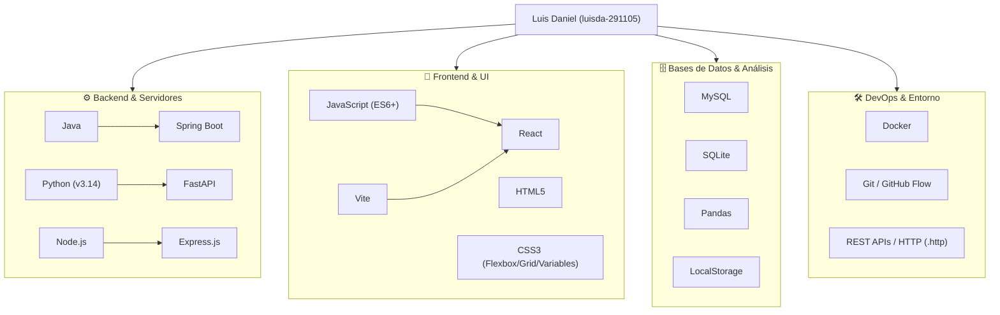

# 🔍 Análisis Exhaustivo del Perfil de GitHub: `luisda-291105`

---

## 1. 👤 Identidad del Perfil

* **Nombre de Usuario:** `luisda-291105`
* **Nombre Real:** Luis Daniel Pérez Pinedo
* **ID de GitHub:** `211262688`
* **Fecha de Creación:** 11 de Mayo de 2025
* **Ubicación inferida:** Medellín, Colombia (según red de profesores y centros de estudio).
* **Cuenta vinculada / predecesora identificada:** [`luisda-29`](https://github.com/luisda-29) (creada 4 días antes, el 7 de mayo de 2025; ambas cuentas comparten autoría de commits, ramas y repositorios).

---

## 2. 👥 Perfiles Amigos y Red de Contactos

El usuario sigue a 6 desarrolladores clave en su entorno académico y de proyectos:

| Usuario | Nombre / Rol | Detalles & Relación |
| :--- | :--- | :--- |
| [**@profejuanjosegallego**](https://github.com/profejuanjosegallego) | Juan José Gallego Mesa | **Docente de desarrollo de software** en Medellín. Luis Daniel participa en sus repositorios de clase y talleres prácticos. |
| [**@Ces1020**](https://github.com/Ces1020) | María Alejandra Londoño Cardona | **Compañera de proyecto clave**. Creadora del repositorio colaborativo `flor-de-loto` ("proyecto escolar"). |
| [**@Saragaleo**](https://github.com/Saragaleo) | Sara Galeo | **Compañera de equipo**. Colaboradora con rama/fork en el proyecto `flor-de-loto`. |
| [**@Arxilo**](https://github.com/Arxilo) | Mateo Arcila Patiño | **Compañero de clase / desarrollador** en proyectos formativos. |
| [**@Mauriciompava**](https://github.com/Mauriciompava) | Mauricio Pava | **Desarrollador web** y colega en la red académica. |
| [**@moraj-dev**](https://github.com/moraj-dev) | Moraj Tech. | **Desarrollador / perfil técnico** vinculado al mismo grupo. |

---

## 3. 🤝 Colaboraciones y Contribuciones

Se detectaron múltiples colaboraciones tanto en repositorios externos como proyectos compartidos:

### A. Repositorios de Terceros con Contribución Directa:
1. **`Ces1020/flor-de-loto` y `Saragaleo/flor-de-loto`**:
   * Proyecto escolar colaborativo de maquetación y diseño web.
   * Luis Daniel aportó más de 30 commits enfocados en:
     * Estructuración del footer y formularios de suscripción/contacto.
     * Depuración y optimización de CSS (reemplazo de colores duros por variables CSS).
     * Ajustes de accesibilidad, layout responsive (Flexbox) y despliegue en GitHub Pages.
2. **`profejuanjosegallego/parcialalternoJava1`**:
   * Pull Request #4 enviado: *"Feature ld"* (implementación de examen/ejercicio en Java).
3. **`profejuanjosegallego/repasoestructuras`**:
   * Pull Request #1 enviado: *"FEAT se agrego un Loguin cansillo y un menú"*.
4. **`profejuanjosegallego/colectivoviernesnoche20252`**:
   * Pull Request #7 enviado: *"se crea sout con mi nombre en la main FEAT"*.

### B. Proyectos Propios con Trabajo Guiado / Integrado:
* **`app_tienda`**: Flujo de trabajo con PR #1 titulado *"Profesor creo estas partes"*, seguido de PRs para registrar productos, listar productos y arquitectura de servicios.
* **`tienda-virtual-proyecto-final`**: Proyecto integrador con módulos frontend (`Restaurant Website`, `dashboard-tienda`) y backend (`BACKEND_TIENDA_NODE_MYSQL`).

---

## 4. 📂 Catálogo Completo de Repositorios (15 Repos)

| # | Repositorio | Lenguaje Principal | Enfoque & Descripción |
| :-: | :--- | :--- | :--- |
| 1 | [**concesionario**](https://github.com/luisda-291105/concesionario) | Java | Backend escolar en Spring Boot con arquitectura en capas (modelo, dto, controlador). |
| 2 | [**perosnal-app**](https://github.com/luisda-291105/perosnal-app) | Java | Backend orientado a microservicios: bloc de notas seguro, autenticación y finanzas. |
| 3 | [**perosnal-app-web**](https://github.com/luisda-291105/perosnal-app-web) | CSS / JS | Interfaz frontend complementaria para la aplicación personal. |
| 4 | [**backend_login**](https://github.com/luisda-291105/backend_login) | Python | Backend con Python 3.14 y FastAPI, empaquetado en Docker para gestión de sesiones. |
| 5 | [**parking_system**](https://github.com/luisda-291105/parking_system) | Python | Sistema de gestión de parqueadero con persistencia SQLite y análisis con Pandas. |
| 6 | [**social-network**](https://github.com/luisda-291105/social-network) | JavaScript / React | Prototipo interactivo de red social similar a Facebook con Vite. |
| 7 | [**hotel_app**](https://github.com/luisda-291105/hotel_app) | JavaScript / React | Proyecto académico para aprendizaje y dominio de React. |
| 8 | [**gestor-tareas**](https://github.com/luisda-291105/gestor-tareas) | JavaScript | Proyecto integrador de frontend: tareas, usuarios, validaciones y LocalStorage. |
| 9 | [**tienda-virtual-proyecto-final**](https://github.com/luisda-291105/tienda-virtual-proyecto-final) | HTML / CSS / JS | Proyecto final fullstack: Tienda + Dashboard + Backend Node/MySQL. |
| 10 | [**app_tienda**](https://github.com/luisda-291105/app_tienda) | CSS / JS | Práctica de consumo de APIs REST y métodos HTTP (GET, POST, etc.). |
| 11 | [**taller_consumo_apis**](https://github.com/luisda-291105/taller_consumo_apis) | CSS / JS | Módulos de consumo de OpenWeather API, PokeAPI y galería de fotos dinámicas. |
| 12 | [**cineflix**](https://github.com/luisda-291105/cineflix) | HTML / JS | Plataforma de películas con CRUD dinámico, localStorage y soporte de IA. |
| 13 | [**clase**](https://github.com/luisda-291105/clase) | Python / JS | Ejercicios de asincronía, promesas y consumo de servicios. |
| 14 | [**luisda-291105**](https://github.com/luisda-291105/luisda-291105) | Markdown | Repositorio especial del perfil con README. |

---

## 5. 💻 Tecnologías y Herramientas Identificadas

---

## 6. 📈 Resumen del Flujo de Trabajo
* **Estrategia Git:** Utiliza flujo de trabajo con ramas descriptivas (`main`, `develop`, `modelo`, `dto`, `repositorio`, `doc`) y apertura ordenada de Pull Requests.
* **Buenas Prácticas:** Adopción de arquitecturas desacopladas, variables CSS para diseño uniforme, estructuración de DTOs en Java Spring Boot, y contenedorización con Docker en microservicios FastAPI.
